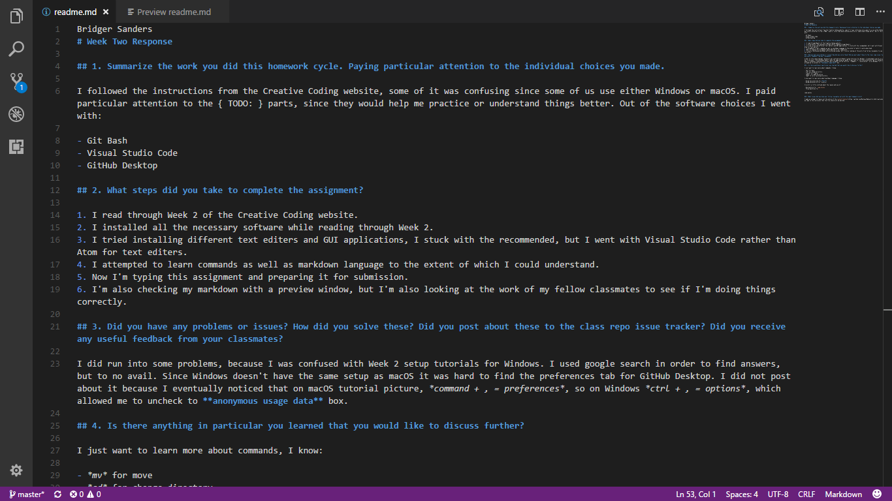

Bridger Sanders
# Week Two Response

## 1. Summarize the work you did this homework cycle. Paying particular attention to the individual choices you made.

I followed the instructions from the Creative Coding website, some of it was confusing since some of us use either Windows or macOS. I paid particular attention to the { TODO: } parts, since they would help me practice or understand things better. Out of the software choices I went with:

- Git Bash
- Visual Studio Code
- GitHub Desktop

## 2. What steps did you take to complete the assignment?

1. I read through Week 2 of the Creative Coding website.
2. I installed all the necessary software while reading through Week 2.
3. I tried installing different text editers and GUI applications, I stuck with the recommended, but I went with Visual Studio Code rather than Atom for text editers.
4. I attempted to learn commands as well as markdown language to the extent of which I could understand.
5. Now I'm typing this assignment and preparing it for submission.
6. I'm also checking my markdown with a preview window, but I'm also looking at the work of my fellow classmates to see if I'm doing things correctly.

## 3. Did you have any problems or issues? How did you solve these? Did you post about these to the class repo issue tracker? Did you receive any useful feedback from your classmates?

I did run into some problems, because I was confused with Week 2 setup tutorials for Windows. I used google search in order to find answers, but to no avail. Since Windows doesn't have the same setup as macOS it was hard to find the preferences tab for GitHub Desktop. I did not post about it because I eventually noticed that on macOS tutorial picture, *command + , = preferences*. Alternatively, *ctrl + , = options* would work for Windows, this allowed me to uncheck the **anonymous usage data** box.

## 4. Is there anything in particular you learned that you would like to discuss further?

I want to learn more about commands, I know:

- *mv* for move
- *cd* for change directory
- *touch* for create
- *mkdir* for make directory
- *pwd* for print working directory

I also want to learn more about markdown language, I know:

- Using two astericks for **bold**
- Using one asterick for *italics*

I'm still a little confused about the reason and use of:

- One backtick for `code blocks`
- Three backticks for

```
code quotes
```

## 5. What issues did you help your fellow classmates out with this past homework cycle?

I made an attempt to figure out the nature of the [.gitattributes?](https://github.com/Montana-Media-Arts/120_CreativeCoding/issues/77) issue, we came to the conclusion that the file should not be deleted.

### Image of my editor



